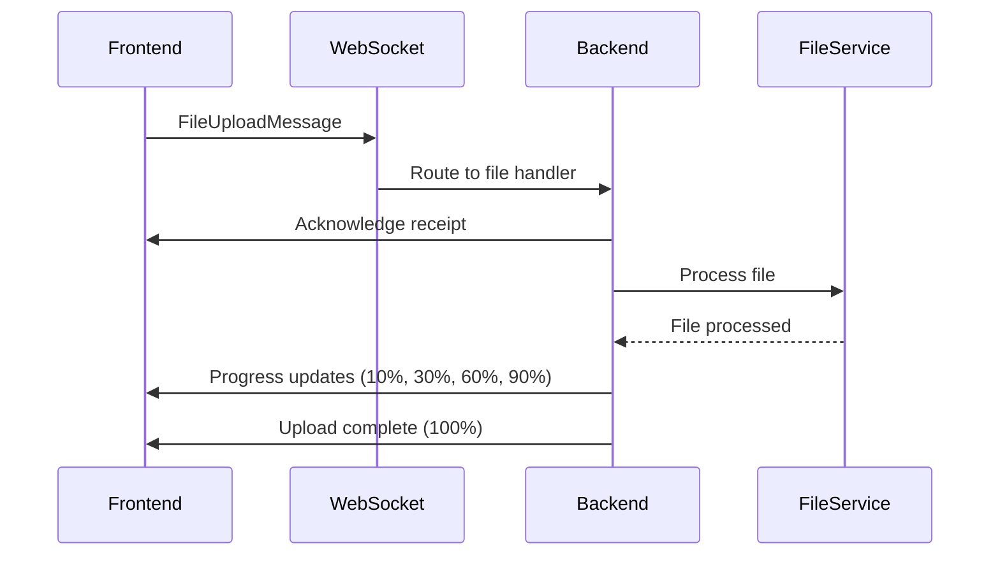
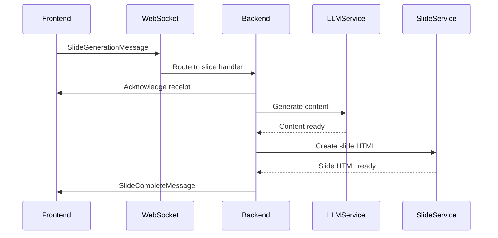

# WebSocket Implementation Migration Guide

This guide helps you migrate from the old WebSocket implementation to the improved one with better error handling, type safety, and service integration.

## What's Changed

### Backend Improvements

1. **New Message Models** (`/backend/src/models/websocket_messages.py`):
   - Proper TypeScript-like type definitions with Pydantic
   - Enum-based message types for consistency
   - Request/response tracking with unique IDs
   - Better validation and error handling

2. **Improved WebSocket Manager** (`/backend/src/core/improved_websocket_manager.py`):
   - Better connection lifecycle management
   - Automatic cleanup of stale connections
   - Message acknowledgment system
   - Proper error propagation
   - Session state management

3. **Cleaner WebSocket Router** (`/backend/src/routers/improved_websocket.py`):
   - Service-based message handling
   - Clear separation of concerns
   - Better progress tracking
   - Async service integration

### Frontend Improvements

1. **Improved WebSocket Service** (`/services/improved-websocket-service.ts`):
   - Singleton pattern with proper state management
   - Automatic reconnection with exponential backoff
   - Message queuing during disconnections
   - Request/response correlation
   - Type-safe message interfaces

2. **Enhanced React Hook** (`/hooks/use-improved-websocket.ts`):
   - Better state management to prevent stale closures
   - Memoized callbacks to prevent re-renders
   - Built-in file upload handling
   - Comprehensive error handling

## Migration Steps

### Step 1: Update Backend Dependencies

Add these imports to your existing files:

```python
# In your main.py or router files
from src.models.websocket_messages import *
from src.core.improved_websocket_manager import websocket_manager
from src.routers.improved_websocket import websocket_endpoint
```

### Step 2: Replace WebSocket Endpoint

Replace the old WebSocket endpoint registration with:

```python
# In main.py
from src.routers.improved_websocket import websocket_endpoint

app.websocket("/ws/{client_id}")(websocket_endpoint)
```

### Step 3: Update Frontend Package Dependencies

Add UUID generation dependency:

```bash
npm install uuid @types/uuid
```

### Step 4: Update Frontend Components

Replace old WebSocket usage:

```typescript
// Old usage
import { useWebSocket } from '@/hooks/use-websocket';

// New usage
import useImprovedWebSocket from '@/hooks/use-improved-websocket';

const MyComponent = () => {
  const {
    state,
    sendFileUpload,
    sendThemeSelection,
    sendContentPlanning,
    sendSlideGeneration,
    isConnected
  } = useImprovedWebSocket({
    clientId: 'user123',
    onProgress: (progress) => {
      console.log(`${progress.step}: ${progress.progress}% - ${progress.message}`);
    },
    onSlideComplete: (slide) => {
      console.log('Slide completed:', slide.slide_name);
    },
    onError: (error) => {
      console.error('WebSocket error:', error.error_message);
    }
  });

  // Use the improved methods
  const handleFileUpload = async (file: File) => {
    try {
      await sendFileUpload(file);
    } catch (error) {
      console.error('Upload failed:', error);
    }
  };
};
```

## New Message Flow

### File Upload Flow



### Slide Generation Flow



## Key Improvements

### 1. Better Error Handling

```typescript
// Errors are now properly typed and include retry information
interface ErrorResponse {
  error_code: string;
  error_message: string;
  details?: string;
  retry_possible: boolean;
}
```

### 2. Request/Response Correlation

```typescript
// Every request gets an ID for tracking responses
const response = await sendContentPlanning(outline);
// The response is automatically correlated with the request
```

### 3. Automatic Reconnection

```typescript
// The service automatically reconnects with exponential backoff
// Messages are queued during disconnection and sent when reconnected
```

### 4. Better State Management

```typescript
// The hook provides comprehensive state
const { state } = useImprovedWebSocket({
  clientId: 'user123'
});

console.log(state.currentStep); // 'upload', 'theme', 'content', etc.
console.log(state.progress); // 0-100
console.log(state.isProcessing); // boolean
console.log(state.error); // null or error message
```

## Testing the Migration

### Backend Tests

```bash
cd backend
uv run python test_improved_websocket.py
```

### Frontend Tests

```bash
# In a test component
import useImprovedWebSocket from '@/hooks/use-improved-websocket';

const TestComponent = () => {
  const { state, connect, sendStatusRequest } = useImprovedWebSocket({
    clientId: 'test-client',
    autoConnect: false
  });

  const testConnection = async () => {
    const connected = await connect();
    if (connected) {
      await sendStatusRequest();
    }
  };

  return (
    <div>
      <p>Connected: {state.isConnected ? 'Yes' : 'No'}</p>
      <button onClick={testConnection}>Test Connection</button>
    </div>
  );
};
```

## Rollback Plan

If issues arise, you can rollback by:

1. Reverting to old WebSocket endpoint in `main.py`
2. Using old hooks and services in frontend
3. The old files remain untouched during migration

## Performance Benefits

- **Reduced Memory Usage**: Proper cleanup prevents memory leaks
- **Better Connection Management**: Fewer failed connections and race conditions  
- **Improved User Experience**: Better progress feedback and error messages
- **Type Safety**: Compile-time error checking reduces runtime issues

## Security Improvements

- **Input Validation**: All messages are validated with Pydantic models
- **File Size Limits**: Enforced file size limits in validation
- **Connection Limits**: Maximum connection limits prevent resource exhaustion
- **Timeout Handling**: Proper timeouts prevent hanging connections

This migration provides a more robust, maintainable, and user-friendly WebSocket implementation for your AI SaaS slide generation application.