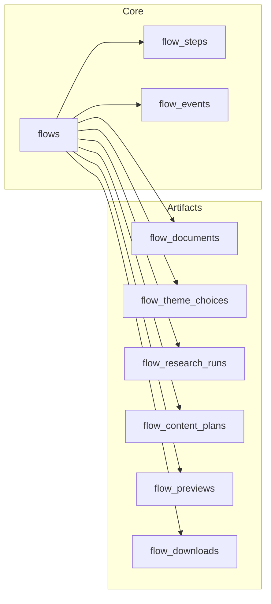

# Data schema and flow logging pattern

This document explains how Slideo persists every step of the slide‑building workflow into Supabase for auditability, analytics, and model training.

## Goals

- Capture end‑to‑end user journeys deterministically
- Separate immutable chronology (events) from step “snapshots” and large artifacts
- Keep queries simple for both “final state” and “how we got here”
- Enforce per‑user data isolation with RLS

## Core model

At the center is one `flow` per slide‑building session. All other tables reference `flows.id`.



### flows
- One row per session. Columns: `id, user_id, status, current_step, description, created_at, updated_at`.
- Use it as the anchor for RLS and joins.

### flow_steps (optional snapshots)
- One row per step per flow. Columns include `step, status, input_snapshot, output_snapshot`.
- Use for the latest “state at step” without reading the entire event stream.

### flow_events (append‑only chronology)
- Every meaningful action is an event. Columns include `step, actor (user|ai|system), event_type, payload, correlation_id, created_at`.
- Use for training sequences, audits, and request↔response correlation.

## Artifact tables

- `flow_documents`: uploaded file metadata + parsed text (`parse_success`, `parse_error`, `content`).
- `flow_theme_choices`: chosen `template_id`, `palette` (jsonb), `palette_source` (curated|logo|ai|manual), `prompt`, `logo_url`.
- `flow_research_runs`: each Tavily execution – `query`, `options` (jsonb), formatted `result`, `sources` (jsonb), `answer`, `status`, `duration_ms`.
- `flow_content_plans`: AI `ai_plan`, user `user_edit`, and the `final_plan` used for generation, plus `planning_context` (jsonb).
- `flow_previews`: each generation attempt – `request_payload` (jsonb), `model`, `slide_html`, `success`.
- `flow_downloads`: exports – `format` (pptx|google_slides|html), `url` (if uploaded/shared), `success`.

## Event taxonomy (suggested)

- Upload: `file_added`, `file_removed`, `file_parsed`
- Theme: `palette_generated`, `palette_applied`, `template_selected`
- Research: `research_requested`, `research_completed`, `research_failed`
- Content: `plan_requested`, `plan_generated`, `plan_edited`
- Preview: `slide_generation_requested`, `slide_generated`, `slide_generation_failed`
- Download: `download_pptx_requested`, `download_pptx_completed`, `download_pptx_failed`, `download_html`, `open_google_slides`

## RLS and ownership

Row Level Security is enabled for all tables. Ownership is enforced by anchoring child rows to `flows.user_id`:

```sql
using (
  exists (
    select 1 from public.flows f
    where f.id = flow_id and f.user_id = auth.uid()
  )
)
```

This ensures each user can only access their own flows and all linked artifacts/events.

## Ingestion pattern (routes)

- Frontend sends `flow_id` in request bodies.
- API routes record both an event and an artifact row, e.g.:
  - `/api/plan-content`: `plan_requested` → insert `flow_content_plans` → `plan_generated`
  - `/api/research`: `research_requested` → insert `flow_research_runs` (success/no_results/error) → completion event
  - `/api/generate-slide`: `slide_generation_requested` → insert `flow_previews` → `slide_generated`
  - `/api/generate-pptx`: `download_pptx_requested` → insert `flow_downloads` → `download_pptx_completed`

## Query recipes

1) Latest content plan for a flow
```sql
select * from flow_content_plans
where flow_id = $1
order by created_at desc
limit 1;
```

2) Full training sequence (events) for a flow
```sql
select step, actor, event_type, payload, created_at
from flow_events
where flow_id = $1
order by created_at asc;
```

3) Aggregate outcomes (success rate by step)
```sql
select step,
       count(*) filter (where actor = 'ai' and event_type like '%_completed') as completed,
       count(*) filter (where actor = 'system' and event_type like '%_failed')    as failed
from flow_events
group by step
order by step;
```

## Notes & recommendations

- Keep `payload` small and structured (ids, short text, numeric stats). Store large bodies in artifact tables.
- Use `correlation_id` in `flow_events` to link request and response when the same step performs async work.
- Add GIN indexes over jsonb columns if you plan to filter on specific keys frequently.


